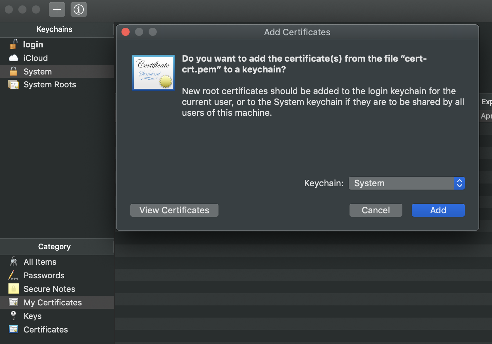
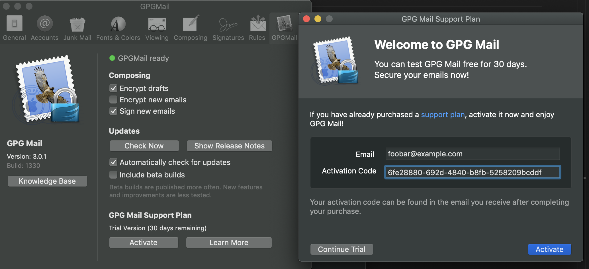
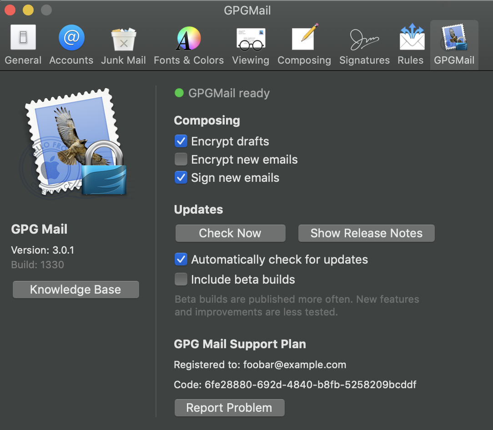

# GPGMail crack

## 1. What is GPGMail

GPGMail is an extension for __Apple Mail__ that provides public key email encryption and signing. GPGMail works under macOS and the actual cryptographic functionality is handled by GNU Privacy Guard.

Start from GPG Suite 2018.4, GPGMail is no longer under free license.

## 2. How this crack works

After you enter your email and activation code, GPGMail will send some information including your OS type and hardware ID, not only the two items you just entered, to `https://v3.paddleapi.com`, which is likely an activation server, by POST request under HTTPS. 

Then the activation server will check the infomation received and return success or error.

So what this keygen does is just returing success whatever the POST request is.

## 3. How to use

As the POST request is under HTTPS, we must play Man-In-The-Middle attack.

### 3.1 Import a self-signed SSL certificate

I've already prepared a SSL certificate, `cert-crt.pem`, and the corresponding private key, `cert-key.pem`. They are generated by the following command:

```
$ openssl req -x509 -newkey rsa:4096 -keyout cert-key.pem -out cert-crt.pem -nodes -days 3650 -subj '/CN=v3.paddleapi.com'
 ```

* PS: Of course you can re-generate a SSL certificate.

Now you must import the SSL certificate, `cert-crt.pem`, to your system keychain and always trust it:




### 3.2 Resolve v3.paddleapi.com to 127.0.0.1

Add an item 

```
127.0.0.1    v3.paddleapi.com
```

to `/etc/hosts`

### 3.3 Run a HTTPS server

```
$ sudo ./paddleapi_server.py
```

* Why do we need `sudo`? 

  Creating a HTTPS server will bind a socket on port 443 which is lower than 1024. On macOS, a root privilege is required.

### 3.4 Goto GPGMail Preference and activate



* __NOTICE:__ Activation Code can be anything. But you must make sure that the length of it is varing from 31 ~ 53.

* __NOTICE:__ You can use `gen_activation_code.py` to generate activation code.

  ```
  $ ./gen_activation_code.py
  ```

Finally it should succeed.



### 3.4 Close HTTPS server and REMOVE SSL certificate

`Ctrl + C` to close the HTTPS server in console. 

__For security reason, you'd better remove the SSL certificate in system keychain.__

### 3.5 Restore hosts (Optional)

If you like, you can remove the item

```
127.0.0.1    v3.paddleapi.com
```

in `/etc/hosts`.

